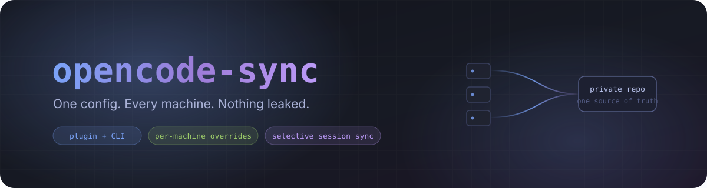
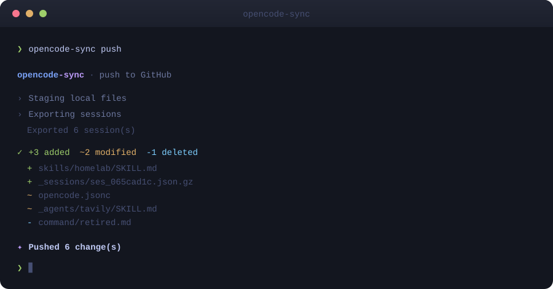
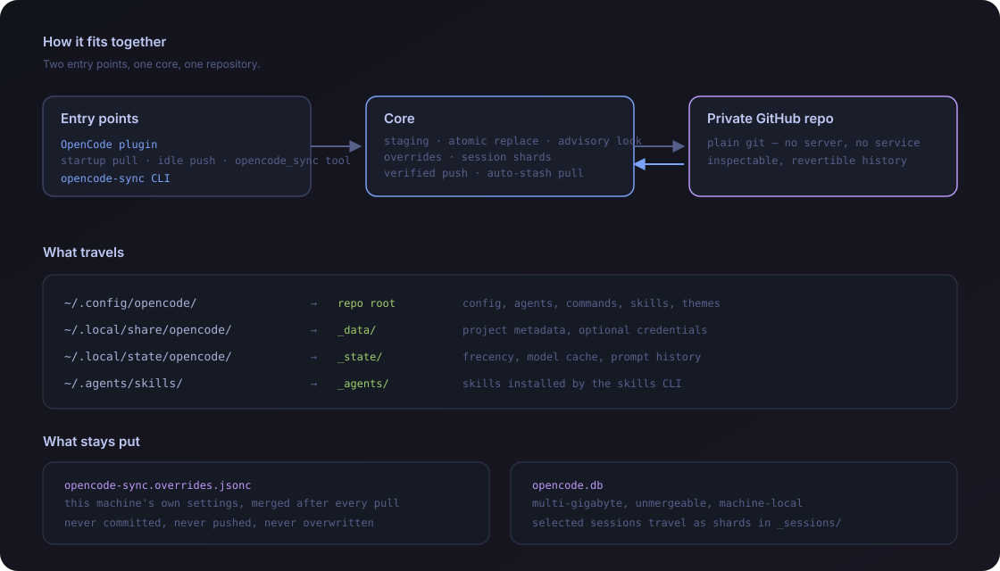

<p align="center">
  
</p>

<p align="center">
  <a href="https://www.npmjs.com/package/opencode-github-sync"></a>
  <a href="https://github.com/doomsday616/opencode-github-sync/actions/workflows/ci.yml"></a>
  <a href="./LICENSE"></a>
  
</p>

<p align="center">
  <a href="./README.md">English</a>
  &nbsp;·&nbsp;
  <a href="#快速开始">快速开始</a>
  &nbsp;·&nbsp;
  <a href="#单机覆盖">单机覆盖</a>
  &nbsp;·&nbsp;
  <a href="#会话同步">会话同步</a>
  &nbsp;·&nbsp;
  <a href="#命令速查">命令</a>
</p>

---

你在多台机器上用 OpenCode。配置、agent、命令、skill、MCP 全都留在最后碰过的那台上。

**opencode-github-sync** 通过一个私有 GitHub 仓库把它们对齐——可以当 OpenCode
插件用，可以当命令行工具用，也可以两个都用。

```bash
npm install -g opencode-github-sync
opencode-sync init          # 建好私有仓库并配置好这台机器
opencode-sync push
```

<p align="center">
  
</p>

---

## 为什么再造一个

大多数配置同步工具，一旦真正投入使用就不再安全了。问题集中在三个地方。

|              | 常见做法                          | 这里的做法                                            |
| ------------ | --------------------------------- | ----------------------------------------------------- |
| **机器差异** | 强制所有机器完全一致              | [单机覆盖](#单机覆盖)，同步永远盖不掉                 |
| **会话**     | 直接提交 `opencode.db`，几个 GB，无法合并 | [按会话分片](#会话同步)，几 MB，天然不冲突      |
| **出问题时** | 纯插件：配置写坏了就没有退路      | CLI 在 OpenCode 之外运行，永远能救回来                |

还有一些听起来无聊、但真出事的时候很关键的事：

- **符号链接直接拒绝，不跟随。** 不会顺着链接把机器上别的文件抄进仓库，Windows 上的目录联接也不会让一次删除删错地方。
- **所有替换都是原子的。** 同步中途崩了，也不会留下一个写了一半、让 OpenCode 起不来的配置文件。
- **push 会回读远端校验。** `git push` 可能返回 0 但远端根本没动，这一点是验证过的，不是假设的。
- **不会有两个同步同时跑。** 跨进程锁覆盖插件、CLI 和每一个 OpenCode 窗口。
- **凭据默认不同步**，且在公开仓库上会被直接拒绝。
- **你的主机名不会离开这台机器。** 提交署名用的是稳定的化名，公司资产编号不会落进一个未必永远私有的仓库。

---

## 安装

### 作为 OpenCode 插件

```jsonc
// ~/.config/opencode/opencode.json
{
  "$schema": "https://opencode.ai/config.json",
  "plugin": ["opencode-github-sync"]
}
```

OpenCode 下次启动时会自动安装。插件提供启动时自动 pull、会话空闲时可选自动
push，以及一个 `opencode_sync` 工具——直接用自然语言说一句"同步一下"就行。

### 作为命令行工具

```bash
npm install -g opencode-github-sync
```

**即使你用插件，也请保留 CLI。** 插件救不了那个"导致插件加载不了"的配置。

**依赖** — git，以及用于自动初始化的 [`gh`](https://cli.github.com)。
配置同步需要 Node 18+；[会话同步](#会话同步)需要 Node 22.5+ 或 Bun。

---

## 快速开始

### 第一台机器

```bash
opencode-sync init                 # → <你的用户名>/my-opencode-config
opencode-sync init team-config     # 自定义仓库名
opencode-sync init my-org/shared   # 建在组织下
opencode-sync push
```

`init` 会建一个**私有**仓库，写好 `~/.config/opencode/opencode-sync.jsonc`，
并留一个空的覆盖文件给你。

### 其他机器

```bash
opencode-sync link doomsday616/my-opencode-config
opencode-sync pull
```

然后重启 OpenCode。

### 日常

```bash
opencode-sync push        # 把这台的改动发出去
opencode-sync pull        # 把别处的改动拿回来
opencode-sync status      # 看什么同步了、什么没同步
```

---

## 同步哪些东西

<p align="center">
  
</p>

| 本地位置                   | 仓库里      | 内容                                     |
| -------------------------- | ----------- | ---------------------------------------- |
| `~/.config/opencode/`      | 仓库根目录  | 配置、agent、命令、skill、主题、MCP      |
| `~/.local/share/opencode/` | `_data/`    | 项目元数据、可选的凭据                   |
| `~/.local/state/opencode/` | `_state/`   | frecency、模型缓存、提示词历史           |
| `~/.agents/skills/`        | `_agents/`  | 用 `skills` CLI 安装的技能               |
| 选中的会话                 | `_sessions/`| 每个会话一个 gzip 分片                   |

**永远不同步：** `opencode.db` 及其日志文件、工具输出、快照、日志，以及你的本地
设置和覆盖文件。

其他路径用 `extraPaths` 加：

```jsonc
{
  "extraPaths": [".tavily", ".config/gh/config.yml"]
}
```

---

## 单机覆盖

同步会让所有机器变得一模一样。但有些设置本来就该因机器而异：公司代理、本地工具链
路径、只有某一台才有的 MCP 服务。

把这些写进 `~/.config/opencode/opencode-sync.overrides.jsonc`：

```jsonc
{
  "model": "github-copilot/claude-sonnet-4",
  "mcp": {
    "playwright": { "enabled": true }
  }
}
```

```
   仓库里的 opencode.jsonc     所有机器共享的基线，进 Git
 + overrides.jsonc            只属于这台机器，永不进 Git
 ─────────────────────────    深合并
 = 实际的 opencode.jsonc      OpenCode 真正读到的
```

合并规则：对象逐键合并，数组和标量整体替换，`null` 删除该键。

**别的工具做错的是 push 这一半。** 因为磁盘上那份就是合并后的结果，直接推就会把你
的私有设置推给所有人。这里的做法是：凡是覆盖文件声明过的键，提交前一律还原成仓库
里原本的值——所以被覆盖的键在两个方向上对同步都是隐形的，而你这台机器全程保持自己
的设置。

> 没有覆盖文件时，配置是逐字节复制的，注释和格式原样保留。只有你真的启用了覆盖，
> 才会发生结构化重写。

---

## 会话同步

默认关闭。**只在私有仓库上开** —— 聊天记录是隐私数据。

```bash
opencode-sync sessions enable
opencode-sync sessions list
opencode-sync sessions include ses_065cad1caffeN3lf1RgLZno30   # 永久固定这个会话
opencode-sync sessions exclude ses_0ba19b4e7ffeMbSmWYi3Nj6xfZ  # 这个永远不同步
```

### 为什么不直接提交数据库

一个真实使用的 OpenCode 数据库会长到几个 GB，绝大部分是 `part.data` 里的工具输出。
Git 无法对它做增量压缩，GitHub LFS 免费额度只有 1 GB，而且把一个正在被写入的数据库
连同它的 WAL 一起拷走，可能拿到一份撕裂的数据——这种问题往往过很久才暴露。

所以会话是**一个一个导出**的。每个会话变成一个独立的 gzip JSON 分片，里面装着它自己
的数据行，外加它依赖的 project 和 workspace 行：

- **没有大文件。** 分片体积小，压缩率高。
- **冲突自动隔离。** 两台机器改不同会话就是改不同文件，Git 不需要任何特殊处理就能
  合并。唯一的真冲突是同一个会话在两边都改了，这时 `time_updated` 新的一方胜出——
  正在进行的对话不会被一份过期的副本覆盖。
- **你决定同步什么。** 时间窗口、显式固定列表、项目目录过滤、单会话体积上限。老会话
  就留在原来那台机器上。

导入是事务里的 upsert，失败了你的数据库原封不动。

```jsonc
{
  "sessions": {
    "enabled": true,
    "days": 7,             // 只同步这么多天内动过的会话
    "maxSessions": 50,     // 单次 push 上限，按时间从新到旧
    "maxSessionBytes": 5242880,  // 跳过体积失控的单个会话
    "include": [],         // 无视时间窗口，永远同步
    "exclude": [],         // 永远不同步
    "directories": []      // 只同步这些项目目录下的会话
  }
}
```

> 内部的 `event` 日志表被刻意排除了。它是行数最多的表，而恢复一段对话完全不依赖它。

---

## 命令速查

| 命令                               | 作用                              |
| ---------------------------------- | --------------------------------- |
| `opencode-sync init [名称]`        | 创建私有同步仓库                  |
| `opencode-sync link <owner/repo>`  | 让这台机器连上已有仓库            |
| `opencode-sync push`               | 把本机配置发出去                  |
| `opencode-sync pull`               | 应用共享配置                      |
| `opencode-sync status`             | 查看同步状态                      |
| `opencode-sync sessions list`      | 列出最近会话和它们的 id           |
| `opencode-sync sessions enable`    | 开启选择性会话同步                |
| `opencode-sync sessions include`   | 固定某个会话，无视时间窗口        |
| `opencode-sync overrides`          | 创建/定位单机覆盖文件             |
| `opencode-sync config`             | 打印当前设置                      |

| 参数        | 效果                                  |
| ----------- | ------------------------------------- |
| `--force`   | 冲突时覆盖另一边（会二次确认）        |
| `--dry-run` | 只报告会改什么，不写入任何东西        |

| 环境变量                     | 效果                       |
| ---------------------------- | -------------------------- |
| `OPENCODE_SYNC_HOST_ALIAS`   | 指定提交署名用的机器名     |
| `OPENCODE_SYNC_VERBOSE=1`    | 输出完整文件列表和堆栈     |
| `NO_COLOR`                   | 关闭彩色输出               |
| `SYNC_REMOTE_URL`            | 覆盖仓库地址               |

---

## 设置

`~/.config/opencode/opencode-sync.jsonc` —— 永远不会被提交。

```jsonc
{
  "repo": { "owner": "你", "name": "my-opencode-config", "branch": "main" },

  "machineAlias": "laptop",     // 可选；不填则自动生成稳定化名

  "includeCredentials": false,  // auth.json / account.json，仅限私有仓库
  "includeSkills": true,
  "includeState": true,
  "extraPaths": [],

  "sessions": { "enabled": false },

  "autoPullOnStartup": true,    // 仅插件
  "autoPushOnIdle": false       // 仅插件
}
```

---

## 出问题了怎么办

**pull 和本地修改冲突了。** 工作区已经回滚到干净状态，你的改动还在 stash 里，恢复
命令会直接打印出来。什么都没丢。

```bash
cd ~/.config/opencode
git stash list
git stash show -p stash@{0}
```

**提示"本机有 N 个未推送的提交"。** 这是故意拦住的——直接 pull 会毁掉它们。先
`opencode-sync push`，或者用 `pull --force` 明确放弃。

**认证失败。** 跑 `gh auth login -h github.com`。私有仓库需要 `repo` 权限。

**会话同步说没有 SQLite 驱动。** 需要 Node 22.5+ 或 Bun。配置同步不受影响。

**全乱了，OpenCode 起不来了。** CLI 存在的意义就在这里：

```bash
opencode-sync pull --force
```

---

## 开发

```bash
npm install
npm run check     # lint + 类型检查 + 测试
npm run build
```

测试跑在磁盘上一个真实的裸 Git 仓库上，并模拟两台独立机器，所以 push、pull、force、
rebase、stash 以及覆盖机制的往返全都是端到端验证过的。

---

## Star 趋势

<a href="https://star-history.com/#doomsday616/opencode-github-sync&Date">
  <picture>
    <source media="(prefers-color-scheme: dark)" srcset="https://api.star-history.com/svg?repos=doomsday616/opencode-github-sync&type=Date&theme=dark">
    <source media="(prefers-color-scheme: light)" srcset="https://api.star-history.com/svg?repos=doomsday616/opencode-github-sync&type=Date">
    
  </picture>
</a>

---

## 许可证

[MIT](./LICENSE)

<p align="center">
  <sub>如果它帮你省了时间，点个 ⭐ 就很好。</sub>
</p>
